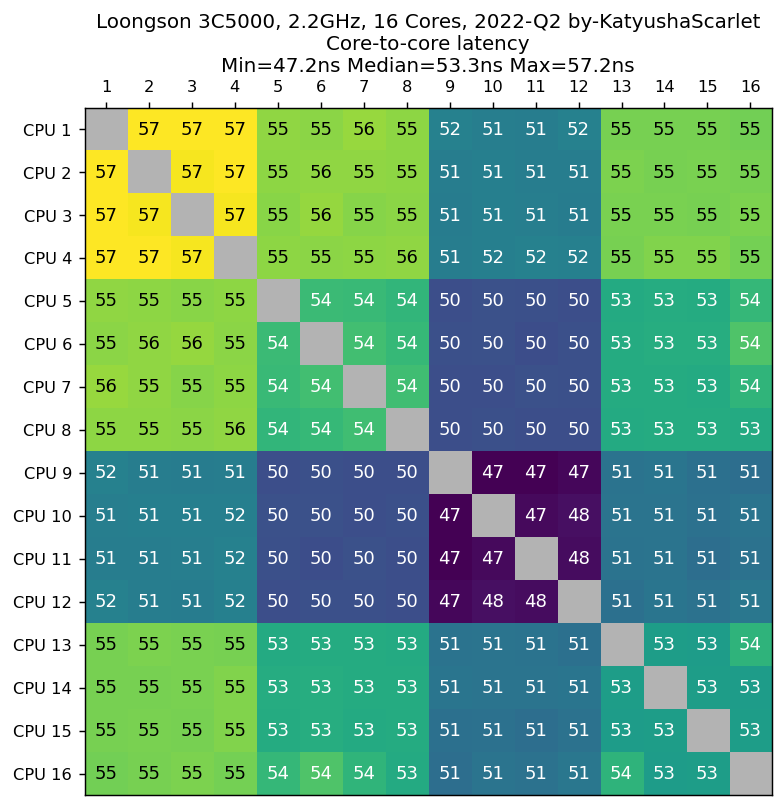

CPU Core-to-Core Latency Tools +
--------------------------------


### Desc


该程序用来计算 CPU 核心间通信延迟.  

具体方式为, 将两个线程固定在两个不同的 CPU 核心上, 通过CPU缓存一致性协议, 让线程执行一系列比较交换操作来测量延迟.

该 fork 旨在提升程序的易用性并收集更多 CPU benckmark 数据来进行展示. 


*** 注意, 由于 MacOS 已经移除了相关接口, 导致本程序依赖的 core_affinity 库无法在 MacOS 系统上将线程绑定到特定的核心上运行, 同时也无法在运行时获取当前核心 ID. 因此本程序在MacOS 上的测试结果严格来说是无效的 (可能都被调度到了相同的一个或几个核心上). 建议 Mac 用户安装 Linux 系统进行测试 ***


### How to run

如何运行:

#### 下载预编译版本并运行

请到 [https://github.com/KCORES/core-to-core-latency-plus/releases](https://github.com/KCORES/core-to-core-latency-plus/releases) 下载.

下载完毕后, Linux 系统运行:

```
core-to-core-latency-plus -b 1 --upload
```

Windows 系统需要打开 CMD,  cd 到文件所在目录并运行:

```
core-to-core-latency-plus.exe -b 1 --upload
```

注意, --upload 选项会上传您的 benchmark 结果到 [https://core-to-core-latency.kcores.com](https://core-to-core-latency.kcores.com).  

您可以根据上传完毕后生成的链接来查看您的结果并生成 heapmap.


#### 使用 cargo 安装并运行
  
```
$ cargo install core-to-core-latency-plus
$ core-to-core-latency-plus -b 1 --upload
```


### Leaderboard 

更多结果欢迎访问: [https://core-to-core-latency.kcores.com](https://core-to-core-latency.kcores.com)

- 按照延迟中间值进行排序, 越小越好

| CPU Name                                                                       | Min Latency | Median Latency | Max Latency |
| :----------------------------------------------------------------------------- | ----------: | -------------: | ----------: |
| AMD Ryzen 5 5600X 6-Core Processor                                             |      7.6818 |        17.6634 |     21.6557 |
| AMD Ryzen 7 5700X                                                              |      7.8170 |        18.0319 |     20.5132 |
| AMD Ryzen 9 5900HX @ 3.3 GHz                                                   |      7.5602 |        18.4311 |     20.8740 |
| AMD Ryzen 7 5800U                                                              |      7.7068 |        18.9389 |     21.3417 |
| AMD Ryzen 5 5500 6-Core Processor                                              |     10.3052 |        18.9881 |     22.6321 |
| AMD Ryzen 7 PRO 5850U 8-Core Processor                                         |      7.7522 |        19.2608 |     22.7955 |
| Intel Core i7-6700K                                                            |      6.8767 |        19.4800 |     23.3867 |
| Intel Xeon E-2176M 2.7GHz                                                      |      6.8374 |        20.2670 |     23.0518 |
| AMD Ryzen 7 5800X3D 8-Core Processor                                           |      7.8564 |        20.3614 |     25.6054 |
| Intel Core i5-10310U                                                           |      7.2062 |        20.4074 |     21.6365 |
| Intel Core i9-9900K CPU @ 3.60GHz                                              |      5.9833 |        20.5833 |     24.4833 |
| AMD Ryzen 5800X3D 8-Core Processor                                             |      5.0000 |        20.6667 |     26.0000 |
| AMD Ryzen 9 5900HX 8-Core Processor                                            |      5.0000 |        20.6667 |     26.0000 |
| Intel Core i7-9700K 3.6GHz                                                     |     15.6667 |        20.6667 |     26.0000 |
| Intel Core i3-4150 3.5GHz                                                      |      5.3333 |        20.6667 |     26.0000 |
| IntelR CoreTM i5-4590 CPU @ 3.30GHz                                            |     20.4767 |        21.1527 |     21.5759 |
| Intel Core 2 Duo CPU T7500 2.2GHz                                              |     22.5429 |        22.5429 |     22.5429 |
| Intel Core i9-9980HK 2.40GHz                                                   |     18.7117 |        22.5849 |     28.2760 |
| IntelR CoreTM i7-1165G7 @ 2.80GHz                                              |      5.7327 |        26.9433 |     29.4373 |
| Intel Core i5-1135G7 2.40GHz                                                   |      6.8352 |        27.3317 |     30.7376 |
| Intel Core i7-12700K                                                           |      4.3645 |        32.2228 |     49.7734 |
| ZHAOXIN KaiXian KX-6640A 2.6GHz 4 Cores 2019-Q2                                |     32.5470 |        32.5487 |     33.0574 |
| Intel Core i7-13700KF 3.4GHz                                                   |      4.0925 |        33.9537 |     53.8947 |
| Intel Celeron 1005M 1.90GHz                                                    |     34.0033 |        34.0033 |     34.0033 |
| Intel Core i5-8600T 2.3GHz                                                     |     32.8742 |        34.1638 |     35.8292 |
| Intel Core i5-12600K 3.7GHz                                                    |      4.4808 |        34.4223 |     53.2846 |
| Intel Core i7-12700H 2.3GHz                                                    |      4.6497 |        35.8870 |     56.8566 |
| Intel Core i7-14700K 3.4GHz                                                    |      4.1059 |        36.3691 |     99.6469 |
| Broadcom BCM2837 4-Core 1.2GHz Raspberry Pi 3B                                 |     36.6658 |        36.6658 |     53.3321 |
| Intel Core i9-12900K                                                           |      4.3483 |        37.1367 |     50.7033 |
| MCST Elbrus-8C2 8Cores 1.55GHz elbrus-v5                                       |     34.0720 |        37.5935 |     50.0501 |
| Loongson 3A6000HV 2.5GHz 4 Cores 2023-Q4                                       |     31.8685 |        38.5869 |     38.7137 |
| Apple.M1.Air                                                                   |     35.9917 |        38.7749 |     47.7950 |
| Intel Xeon E5-2697v3 HT-off                                                    |     29.3343 |        39.2609 |     47.1590 |
| Loongson 3A5000HV 2.5GHz 4 Cores 2021-Q3                                       |     39.4932 |        39.5098 |     39.5285 |
| AMD Custom APU 0405 Valve Steam Deck APU Zen 2 4 cores SMT enabled             |     10.5481 |        40.5395 |     50.6295 |
| AWS Graviton3 from-AWS-c7g.16xlarge                                            |     29.6008 |        46.4012 |     56.8015 |
| AWS Graviton2 from-AWS-c6gd.metal                                              |     30.3997 |        47.1996 |     58.3994 |
| IntelR Xeon Gold 6242 @ 2.8GHz                                                 |      7.3351 |        47.4590 |     58.5769 |
| Intel Core 2 Quad Processor Q9550 2.83GHz                                      |      0.0000 |        51.6667 |     53.3333 |
| Loongson 3C5000 2.2GHz 16 Cores 2022-Q2                                        |     47.1933 |        53.2741 |     57.1524 |
| Apple M1 Ultra                                                                 |     39.6561 |        53.3572 |     84.1167 |
| m1.ultra.16p4e                                                                 |     39.6561 |        53.3572 |     84.1167 |
| Intel Xeon W9-3475X 2.2GHz 36Cores 2023-Q2                                     |     36.3929 |        55.3493 |     72.3715 |
| Dual Intel Xeon Platinum 8360Y 2.40GHz                                         |      7.5606 |        56.7837 |    119.8123 |
| Qualcomm Snapdragon850                                                         |     57.5972 |        64.2396 |     73.3261 |
| Qualcomm Snapdragon 855                                                        |     60.8146 |        65.6601 |    364.8424 |
| AMD Ryzen 9 7950X 16-Core Processor                                            |      5.0000 |        67.6667 |     73.0000 |
| AMD Ryzen 9 7950X                                                              |      5.0000 |        67.6667 |     73.0000 |
| Dual IntelR XeonR CPU X5650  @ 2.67GHz                                         |      7.1077 |        70.2779 |     79.6748 |
| HiSilicon Kunpeng 920-6426 @ 2.6GHz                                            |     29.9564 |        71.7844 |     87.6526 |
| AMD Ryzen 5 2600 6-Core Processor                                              |     10.3333 |        72.6667 |     99.0000 |
| AMD Ryzen 9 9950X 16-Core Processor                                            |     17.2814 |        76.3930 |     82.6227 |
| AMD Ryzen 9 7900X 12-Core Processor                                            |      7.0333 |        77.0833 |     80.7333 |
| AMD Ryzen 9 5950X 3.40GHz                                                      |      7.3642 |        82.5303 |     88.2414 |
| AMD Ryzen 9 5900X                                                              |      7.5500 |        82.5500 |     86.9833 |
| SpacemiT K1 1.60GHz 8-Core                                                     |     32.5704 |        85.3937 |     85.7814 |
| IntelR AtomTM CPU D510 @ 1.66GHz                                               |     10.6665 |        85.9986 |     86.6652 |
| AMD Ryzen 9 3900X 12-Core Processor                                            |      6.7759 |        87.2548 |     95.8354 |
| Broadcom BCM2711 Quad core Cortex-A72 ARM v8 64-bit SoC 1.8GHz Raspberry Pi 4B |     88.9931 |        89.8020 |     89.9820 |
| AMD Ryzen 7 2700X Eight-Core Processor                                         |      9.5963 |        90.7295 |     94.2679 |
| IntelR Xeon PhiTM CPU 7210 @ 1.30GHz                                           |     40.9553 |        91.0294 |    112.4597 |
| AMD Ryzen Threadripper 3960X 3.80GHz 24 Cores Zen 2 3rd Gen 2019-Q4            |      6.3958 |        94.6282 |    104.0642 |
| IntelR XeonR Platinum 8375C CPU @ 2.90GHz from-AWS-c6i.metal                   |      7.9685 |        98.6915 |    116.8181 |
| AMD EPYC 74F3 24-Core Processor                                                |      8.9649 |        98.8013 |    107.1125 |
| Dual Intel Xeon Platinum 8358 CPU 2.60GHz                                      |     41.0048 |        98.9467 |    124.8291 |
| Dual Intel Xeon Gold 6336Y 2.40GHz                                             |      7.3638 |        99.7868 |    114.1930 |
| AMD Ryzen Threadripper 3990X 64-Core Processor                                 |     19.1909 |       102.9295 |    112.4265 |
| AMD Ryzen Threadripper PRO 3945WX 12-Core Processor                            |      6.1877 |       105.0442 |    112.1279 |
| Intel Xeon Phi 7210 1.30GHz                                                    |     53.1602 |       105.3218 |    113.0751 |
| Dual IntelR XeonR CPU E5-2690 0 @ 2.90GHz                                      |      8.2683 |       105.4716 |    171.7845 |
| IntelR XeonR CPU E5-2695 v4 @ 2.10GHz                                          |      7.4887 |       107.2264 |    126.9100 |
| Dual IntelR XeonR CPU E5-2630 v4 @ 2.20GHz                                     |      8.0845 |       107.8309 |    129.0857 |
| AMD EPYC 9754 128-Core Processor                                               |     28.8509 |       109.3847 |    119.6138 |
| AMD EPYC 7773X                                                                 |      9.9268 |       114.8502 |    139.9596 |
| AMD EPYC 7773X 64-Core Processor                                               |      9.9268 |       114.8502 |    139.9596 |
| Dual IntelR XeonR CPU E5-2680 v4 @ 2.40GHz                                     |      7.8932 |       117.5104 |    144.9577 |
| Dual Intel Xeon E5-2698v3 2.3GHz                                               |      5.0000 |       119.6667 |    224.0000 |
| AMD Ryzen 5 3500X 6-Core Processor                                             |     47.0000 |       120.0000 |    140.6667 |
| Intel Xeon CPU E5-2695v4 2.10GHz                                               |     35.1843 |       120.1341 |    161.3051 |
| IntelR XeonR Platinum 8275CL CPU @ 3.00GHz from-AWS-c5.metal                   |      7.4651 |       128.6704 |    139.7132 |
| Dual Intel Xeon E5 2620V2 2.10GHz                                              |     11.2104 |       130.1963 |    201.5718 |
| Dual IntelR Xeon Gold 6242 @ 2.8GHz                                            |      7.2657 |       135.1955 |    146.1889 |
| Apple M1 Pro                                                                   |     38.3332 |       144.1669 |    156.5817 |
| AMD Ryzen Threadripper 1950X                                                   |      9.9778 |       150.9642 |    160.0195 |
| AMD Ryzen Threadripper 1950X 16-Core Processor                                 |      9.9395 |       152.7651 |    165.8613 |
| Dual Ampere Altra Processor Q80-30 CPU 3.0GHz                                  |     67.9924 |       156.2753 |    210.6564 |
| Quad Intel Xeon E5-4650v2 2.4GHz                                               |     10.7816 |       157.4775 |    176.0418 |
| Apple M2 Max                                                                   |     37.0688 |       172.0697 |    181.8459 |
| Dual Ampere Altra Processor Q80-30 CPU 3.0GHz NUMA-off                         |     78.4478 |       179.9726 |    239.3343 |
| Dual AMD EPYC 9654 96-Core Processor                                           |     24.1957 |       184.6257 |    200.9054 |
| AMD Ryzen 9 9950X 16-Core Processor                                            |     17.0227 |       190.4729 |    235.5363 |
| AMD EPYC 7R13 48-Core Processor from-AWS-c6a.metal                             |      9.7475 |       194.5823 |    208.5112 |
| Dual AMD EPYC 9454 48-Core Processor                                           |     10.3170 |       196.7665 |    207.1196 |
| Dual AMD EPYC 9754 128-Core Processor                                          |     12.6618 |       202.4880 |    216.0390 |
| Phytium D2000 8-Core                                                           |     58.6155 |       211.9101 |    223.8014 |
| Dual AMD EPYC 7302 16-Core Processor                                           |      8.3712 |       227.2905 |    249.2347 |
| Dual AMD EPYC 7702 64-Core Processor                                           |     24.1273 |       228.9297 |    251.3631 |
| MCST Elbrus-8C 8Cores 1.2GHz elbrus-v4                                         |     42.7973 |       253.2212 |    320.5725 |
| NXP LX2160A-RDB 16x Arm Cortex-A72 2.2GHz                                      |     60.0019 |       260.0081 |    273.3420 |
| Dual AMD EPYC 7742 64-Core Processor                                           |      8.0196 |       260.6432 |    290.4366 |
| AMD FX-8300 8-Core Processor                                                   |     41.9496 |       267.5885 |    339.6446 |
| Dual AMD EPYC 7763 64-Core Processor                                           |     10.1847 |       289.4902 |    337.3357 |
| Dual AMD EPYC 7601 32-Core Processor                                           |     11.4781 |       354.8678 |    429.9534 |
| Dual Sun-Oracle SPARC T4 8 cores@2.85 GHz                                      |     97.3333 |       355.6667 |    356.3333 |
| Dual Loongson 3B4000 1.8GHz 8 Cores 2019-Q4                                    |    123.0064 |       368.8299 |    547.2583 |
| Dual IBM Power7 8 cores@3.3 GHz 2010-Q1                                        |    156.6639 |       433.3258 |    449.9958 |
| Dual IBM Power9 8335-GTH 16-core 2.7GHz                                        |      0.0000 |       683.3050 |    883.2968 |


### History Results


[History Results](./results/results.ipynb)


### License

MIT
